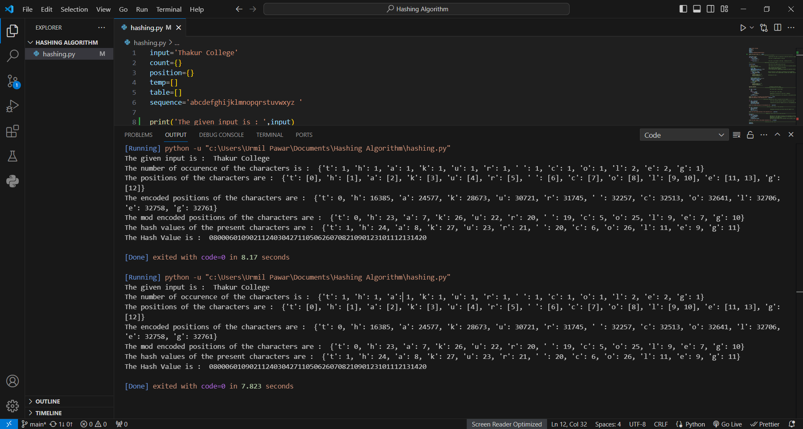
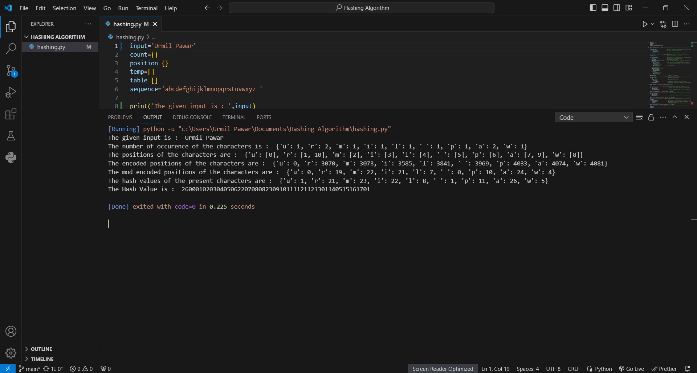

The project focuses on creating a Cryptographic Hashing Algorithm for generating Hash value for the given input string with the help of Python Programming Language.
- The Main idea of the algorithm is generating an encoding for the number of occurrences and for the unique position sequence of every character in the input and then combining them.
- The number of occurrences and the unique position sequence of every character are the characteristics that differ a word from another word.
- The hash value generated is of length 54 characters
- For generating the hash value from the code we have to change the string value of the 'input' variable present on the first line

## Images
- For same input, the same hash value is generated every time

- Hash Value for my name

